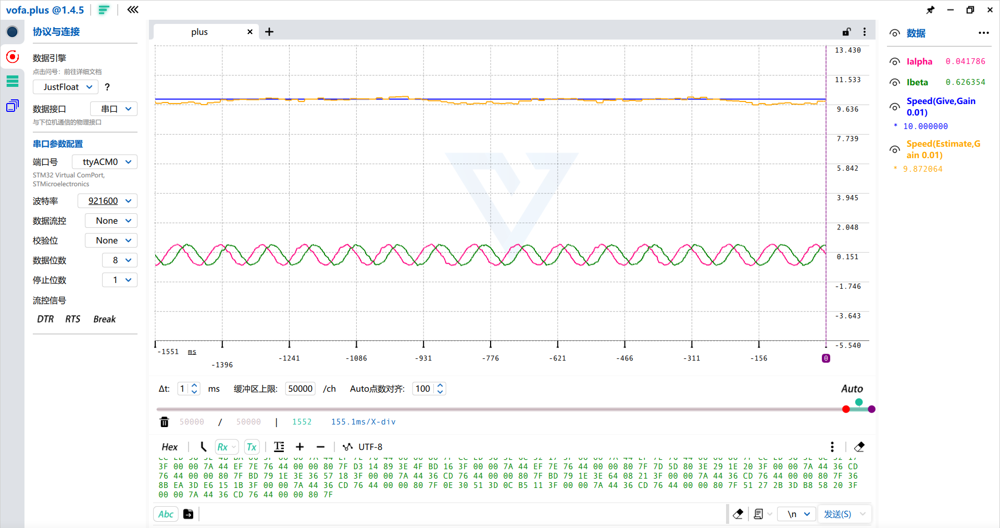

# FOC-Sensorless-EKF-STM32F103C8T6-FixedPoint

无感FOC项目(全定点实现)，采用EKF观测器，MCU采用STM32F103C8T6，板子使用ST的X-NUCLEO-IHM07M1评估板，项目为Clion的CMAKE项目，可以使用Clion或VSCode打开。

该项目纯粹为实验用途，事实上一次定点EKF需要跑25us(可以再优化，比如把32位定点变成16位定点可以防止乘法时提升到64位，但是比较耗费时间，且精度不能保证，需要重新测定各个变量的值，非常麻烦，故没有继续优化)，加上SVPWM，转速环和电流环，电流采样，限幅，跑一次是45us，本来想跑20khz，但是非常极限，所以改为15khz了

为保证定点可读性的同时保证性能，本项目为C23标准的项目，大量使用C23特性constexpr和C11特性_Generic，且使用了C#代码自动生成，依赖编译器的-O2内联展开以保证性能。

## 📋 **总览**

|   参数   |                                                                      说明                                                                      |
|:------:|:--------------------------------------------------------------------------------------------------------------------------------------------:|
|  核心板   |                                                               STM32F103C8T6核心板                                                               |
|  驱动板   |                                                               X-NUCLEO-IHM07M1                                                               |
 |  采样电阻  |                                                               330mOhm,双电阻采样方案                                                                |
| 永磁同步电机 |                                           参数为额定电压12V,最大电流1A,Rs=2.75Ohm,Ls=1mH,flux=0.00386335(V·s)                                           |
| SVPWM  | 使用Timer1,计时器频率72Mhz(未分频),计数值2400-1<br>三通道Channel1,2,3输出PWM<br>第四通道用于触发ADC采样(比较值设为1,对Center Ailgned 1而言,是计数值向上再向下减到1才触发ADC,也就是在每个PWM周期快结束时采样) |
|  电流环   |                                                               PI控制(有抗饱和),15khz                                                               |
 |  转速环   |                                                               PI控制(有抗饱和),1khz                                                                |
 |  观测器   |                                                                  EKF(15khz)                                                                  | 
|  EKF   |                                                       四维状态向量ialpha,ibeta,Espeed,Etheta                                                       |
| 与上位机通信 |                                                         USB通信，VOFA+(JustFloat协议)显示波形                                                         |
| C语言标准  |                                                                     C23                                                                      |
 |  软件版本  |               CLion 2025.3,openocd 0.12.0,CUBEMX 6.16.0,CUBECLT 1.18.0,MATLAB R2024a,VOFA+ 1.4.5,操作系统版本:deepin V23(Linux 6.18)               |


## 🔌 **接线说明**


评估板接12V电源到VIN+和GND，三相输出连接到PMSM上面，F103核心板的PB13、PB14、PB15连接到了评估板的输出使能引脚C7_1、C7_2、C7_3上面。TIM1的PWM输出PA8、PA9、PA10连接到了评估板的C10_23、C10_21、C10_33。注意评估板没有降压模块，因此3V3不是由评估板提供的，需要由核心板提供，这个电压将用于核心板的电流采样。将核心板的3V3和GND连接到评估板的C7_12、C7_20上面。核心板PA0、PA1为A、B相电流采样，接到评估板C7_28、C7_36上面。

> ⚠️ **注意**：评估板上有VIN+直连的C7_24引脚，请勿把核心板接到该引脚上面，以免大电压损坏你的核心板。在接电前建议再次检查接线是否准确，以免损坏你的器件。

## 🛠️ **快速迁移到你的硬件**

由于考虑到不同的硬件情况，不同PMSM对应的参数也不同，为了让代码能适配其它的硬件情况，请按以下步骤修改对应的代码：

1.PMSM的电阻，电感，磁链不同，请修改PMSM_Control_Core/EKF.c里的全局变量对应的参数

2.PMSM的极对数不同，请修改Hardware.h里的POLE_PAIRS参数

3.直流母线电压不同，请修改PMSM_Control_Core/SVPWM.c里的Udc和DivUdc参数

4.采样电路不同（即不使用配套的评估板而是你自己的板子），请修改PMSM_Control_Core/Hardware.c里的IA_K和IB_K参数，这里的参数表示每安电流对应ADC采样端多少伏的电压，由于上电时，会进行一次VCC_3V3，IA_REF，IB_REF离线校正，因此事实上这三个参数并不需要特意修改

5.在不同的硬件上运行时，如果电机不能运行或者运行一会就停止，请调整一下PI参数，使用C#代码自动生成对应的PI控制器

## 📈 **运行以及波形查看**



本代码使用VOFA+作为波形查看器，协议为JustFloat，由于代码中使用USB虚拟串口，所以波特率可以任意设置。在USB_JustFloat.h/.c 里调整singleDataLength和USB_data[USB_DataRecordIndex++]=xxx，可以看到你想要了解的各种运行参数，但是建议singleDataLength不能设置太大，不然发送速率跟不上数据生成的速率，MCU会卡死，电机转不起来。

F103的性能较差，在传输数据前会进行定点到浮点的转换，消耗CPU时间，所以singleDataLength不能设太大(RAM已经92%了，不能再加大了)。

注意这个评估板电流采样有一两个小的尖峰毛刺，在代码stm32f1xx_it.c的void ADC1_2_IRQHandler(void)使用五点中值滤波去除了，但是会造成波形有一点小的失真，如果你使用的硬件没有这种问题，你可以去除掉中值滤波的过程（或者改用IIR滤波，代码中已经有对应的实现，只是没有用到），以获得更准确的波形和控制效果

## 📎 **补充内容**

·本代码使用的定点库由本作者设计，与传统定点库不同，具体差异请查看fixed_point.h里的内容

·本代码的定点范围都是精心整定的，对不同的硬件平台，修改参数可能会出现溢出的情况

·本代码的定点运算函数均使用C#代码自动生成，如果你需要写一些乘法加法之类的运算，并且fixed_point.h里没有你需要的函数，可以使用C#代码自动生成

·C#代码在本项目根目录Program.cs里，为.NET10.0项目

·工程已升级为CUBEMX6.16.0工程，最新版CUBEMX每次默认生成的代码不含有工具链的说明，直接运行会失败，每次生成代码后，需要在CMakeLists.txt较前部分添加一行：

```cmake
# Include toolchain file
include("cmake/gcc-arm-none-eabi.cmake")
```

## ⚠️ **安全须知**

> 🔥 **本项目涉及电机驱动与功率电路，请务必遵守以下安全规范：**
>
> - **切勿在通电状态下插拔或修改接线**  
> - **首次上电建议使用限流电源（如 12V/2A）并串联保险丝**  
> - **强电（>12V DC 或交流）环境下操作需具备专业电气知识，本项目默认在低压（≤12V）安全电压下运行**  
> - **评估板无隔离保护，核心板与功率地共地，请避免误接高压引脚（如 C7_24）**  
> - **调试时建议远离旋转部件，电机意外启动可能导致人身伤害**
>
> ⚡ **安全第一！任何硬件损坏或人身伤害，作者概不负责。**