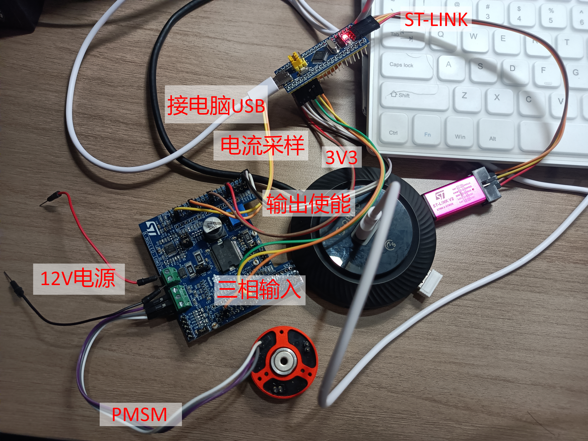
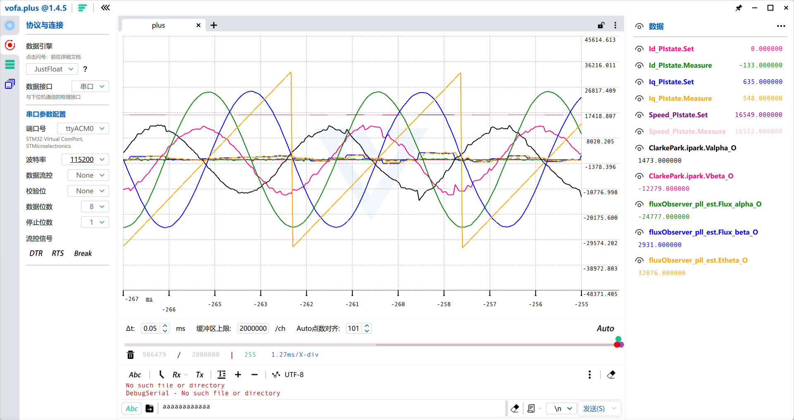

# FOC-Sensorless-STM32F103C8T6-FixedPoint-V2

无感FOC项目(全定点实现)，V2版本暂时实现了非线性磁链观测器，此后会加入更多观测器，MCU采用STM32F103C8T6，板子使用ST的X-NUCLEO-IHM07M1评估板，项目为Clion的CMAKE项目，可以使用Clion或VSCode打开。

本项目设计了一个比较清晰的定点框架，在保证性能的同时，尽量保持其类似浮点的可读性，同时脱离了V1的C#自动生成代码，是纯粹的C代码实现的，定点框架使用了Q15_xx_t{int16_t}保存变量值，Q15_t{int32_t}作为计算中间值防止溢出，防止了使用int64_t的计算，加快了运算速度，同时我们开启了-O2优化和-ffast-math使得我们的代码能够被编译器大幅优化保证控制速度

本项目依旧没有写通信控制逻辑，仍然是上电即给定特定转速，使得电机转起来

## 📋 **总览**

|     参数     |                                                                                                     说明                                                                                                     |
|:------------:|:------------------------------------------------------------------------------------------------------------------------------------------------------------------------------------------------------------:|
|    核心板    |                                                                                             STM32F103C8T6核心板                                                                                              |
|    驱动板    |                                                                                               X-NUCLEO-IHM07M1                                                                                               |
|   采样电阻   |                                                                                            330mOhm,双电阻采样方案                                                                                            |
| 永磁同步电机 |                                                           型号:2804,表贴式电机,参数为额定电压12V,最大电流1A,Rs=2.75Ohm,Ls=1mH,flux=0.00386335(V·s)                                                           |
|    SVPWM     | 使用Timer1,计时器频率72Mhz(未分频),计数值2400-1<br>三通道Channel1,2,3输出PWM<br>第四通道用于触发ADC采样(比较值设为1,对Center Ailgned 1而言,是计数值向上再向下减到1才触发ADC,也就是在每个PWM周期快结束时采样) |
|    电流环    |                                                                                            PI控制(有抗饱和),15khz                                                                                            |
|    转速环    |                                                                                           PI控制(有抗饱和),1.5khz                                                                                            |
|    观测器    |                                                        EKF(15khz,V2版本中暂未实现)或改进的磁链观测器(15khz)<br>可在ADC1中断中更改变量Observer的值切换                                                        | 
|     EKF      |                                                                               暂未实现,四维状态向量ialpha,ibeta,Espeed,Etheta                                                                                |
|  磁链观测器  |                                             我们使用了PLL，并且参考了论文:《Performance Improvement of Nonlinear Flux Observer for Sensorless Control of PMSM》                                              |
| 与上位机通信 |                                                                                    USB通信，VOFA+(JustFloat协议)显示波形                                                                                     |
|   软件版本   |                               CLion 2026.2.1,openocd 0.12.0,arm-gnu-toolchain 15.2,CUBEMX 6.18.1,CUBECLT 1.18.0,MATLAB R2024a,VOFA+ 1.4.5,操作系统版本:deepin V23(Linux 6.18)                                |
|  本软件版本  |                                                                                                    V2.0.0                                                                                                    |


## 🔌 **接线说明**



评估板接12V电源到VIN+和GND，三相输出连接到PMSM上面，F103核心板的PB13、PB14、PB15连接到了评估板的输出使能引脚C7_1、C7_2、C7_3上面。TIM1的PWM输出PA8、PA9、PA10连接到了评估板的C10_23、C10_21、C10_33。注意评估板没有降压模块，因此3V3不是由评估板提供的，需要由核心板提供，这个电压将用于核心板的电流采样。将核心板的3V3和GND连接到评估板的C7_12、C7_20上面。核心板PA0、PA1为A、B相电流采样，接到评估板C7_28、C7_36上面。

> ⚠️ **注意**：评估板上有VIN+直连的C7_24引脚，请勿把核心板接到该引脚上面，以免大电压损坏你的核心板。在接电前建议再次检查接线是否准确，以免损坏你的器件。

## 🛠️ **快速迁移到你的硬件**

由于考虑到不同的硬件情况，不同PMSM对应的参数也不同，为了让代码能适配其它的硬件情况，请按以下步骤修改对应的代码：

1.PMSM的电阻，电感，磁链，极对数不同，请修改PMSM_Control_Core/User_Parameters.h里的全局变量对应的参数

2.直流母线电压、电机最大电流不同，请修改PMSM_Control_Core/User_Parameters.h里的Udc和I_max参数

3.采样电路不同（即不使用配套的评估板而是你自己的板子），请修改PMSM_Control_Core/Hardware.c里的I_K参数，这里的I_K参数表示每安电流对应ADC采样端多少伏的电压。

此外由于上电时，会进行一次VCC_3V3，IA_REF，IB_REF离线校正，因此这三个参数并不需要特意修改，可以保持默认

4.在不同的硬件上运行时，如果电机不能运行或者运行一会就停止，请调整一下PI参数，直接调整PMSM_Control_Core/User_Parameters.h的截止频率即可，也可参考主项目中的文档进行自定义PI参数

[访问主项目](https://github.com/lxcy-tiger/FOC-Sensorless-EKF-STM32G474)

## 📈 **运行以及波形查看**



本代码使用VOFA+作为波形查看器，协议为JustFloat，由于代码中使用USB虚拟串口，所以波特率可以任意设置。在USB_JustFloat.h/.c 里调整singleDataLength和USB_data[USB_DataRecordIndex++]=xxx，可以看到你想要了解的各种运行参数，但是建议singleDataLength不能设置太大，不然发送速率跟不上数据生成的速率，MCU会卡死，电机转不起来。

F103的性能较差，在传输数据前会进行定点到浮点的转换，消耗CPU时间，所以singleDataLength不能设太大，最大只能设成12。

## 📎 **补充内容**

·工程已升级为CUBEMX6.16.0工程，最新版CUBEMX每次默认生成的代码不含有工具链的说明，直接运行会失败，每次生成代码后，需要在CMakeLists.txt较前部分添加一行：

```cmake
# Include toolchain file
include("cmake/gcc-arm-none-eabi.cmake")
```

## ⚠️ **安全须知**

> 🔥 **本项目涉及电机驱动与功率电路，请务必遵守以下安全规范：**
>
> - **切勿在通电状态下插拔或修改接线**
> - **首次上电建议使用限流电源（如 12V/2A）并串联保险丝**
> - **强电（>12V DC 或交流）环境下操作需具备专业电气知识，本项目默认在低压（≤12V）安全电压下运行**
> - **评估板无隔离保护，核心板与功率地共地，请避免误接高压引脚（如 C7_24）**
> - **调试时建议远离旋转部件，电机意外启动可能导致人身伤害**
> - **本代码没有过流保护，如果电机停转可能发热较大，请及时关闭电源，防止电机或板子被烧毁**
> - **本代码暂时未做发送修改速度的功能，上电时即给定转速，因此应注意上电时电机会自动启动**
>
> ⚡ **安全第一！任何硬件损坏或人身伤害，作者概不负责。**